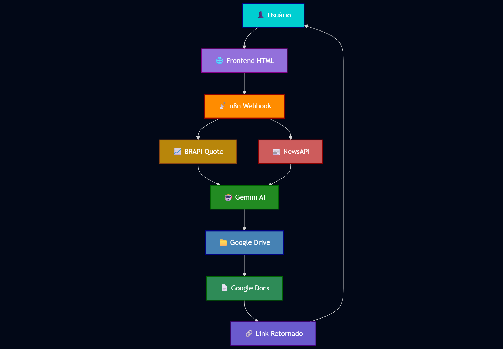

# 🏦 Investment Banking Research Automation

[](https://n8n.io/)
[](https://cloud.google.com/)
[](https://developer.mozilla.org/en-US/docs/Web/JavaScript)
[](https://developer.mozilla.org/en-US/docs/Web/HTML)
[](LICENSE)
[]()

<div align="center">
  
</div>

> Sistema automatizado para análise de empresas de capital aberto brasileiro (B3) para profissionais de Investment Banking

## 📋 Sobre o Projeto

Este projeto automatiza a coleta e análise de informações de empresas listadas na B3 (Brasil Bolsa Balcão), gerando relatórios profissionais em formato Google Docs para uso em análises de Investment Banking.

### 🎯 Atendimento aos Requisitos

Este projeto foi desenvolvido para atender integralmente ao **Teste Prático: Estágio em IA – Automatizando Pesquisa de Empresas** com os seguintes resultados:

### ✅ Requisitos Obrigatórios Atendidos

| Requisito | Status | Implementação |
|-----------|--------|---------------|
| **Entrada via nome de empresa** | ✅ Completo | Frontend HTML com busca inteligente de 400+ empresas B3 |
| **Workflow n8n automatizado** | ✅ Completo | Workflow completo com 9 nós integrados |
| **Resumo/Descrição da empresa** | ✅ Completo | Análise via Gemini AI com dados estruturados |
| **Últimas notícias (2-3)** | ✅ Completo | Integração NewsAPI + análise contextual |
| **Valor atual da ação** | ✅ Completo | Integração BRAPI em tempo real |
| **Saída em Google Docs** | ✅ Completo | Documentos organizados e estruturados |

### 🏆 Diferenciais Implementados

| Diferencial | Status | Detalhes |
|-------------|--------|----------|
| **Página HTML de input** | ✅ Completo | Interface profissional com busca inteligente |
| **APIs gratuitas** | ✅ Completo | Todas as integrações são gratuitas |
| **Análise por IA** | ✅ Plus | Gemini AI para análises profissionais |
| **Automação completa** | ✅ Plus | Zero intervenção manual necessária |
| **Estrutura profissional** | ✅ Plus | Formato Investment Banking real |

### 📋 Checklist de Entregáveis

- ✅ **Documentação do fluxo executado**: Guia completo em [docs/](docs/)
- ✅ **Frontend diferencial**: Interface web profissional implementada
- ✅ **Workflow n8n**: Totalmente funcional e documentado
- ✅ **Integração Google Docs**: Documentos gerados automaticamente

### 🏗️ Arquitetura

<div align="center">
  
</div>

## 🚀 Quick Start

### Pré-requisitos

- Conta n8n (Cloud ou Self-hosted)
- Conta Google Cloud Platform
- Chaves de API necessárias:
  - Google Cloud API Key (Gemini AI)
  - BRAPI Token (gratuito)
  - NewsAPI Key (opcional)

### Instalação Rápida

1. **Clone o repositório**
   ```bash
   git clone https://github.com/RafaelSR44/n8nCapitalAberto.git
   cd investment-banking-automation
   ```

2. **Configure as APIs do Google**
   - Siga o [Guia de Configuração Google APIs](docs/guia-implementacao.md#configuração-google-cloud)

3. **Importe o workflow n8n**
   - Importe o arquivo `n8n/empresa-research-workflow.json`
   - Configure as credenciais conforme [N8N Setup Guide](docs/n8n-workflow-setup.md)

4. **Deploy do frontend**
   - Hospede o arquivo `frontend/index.html` em qualquer servidor web
   - Atualize a URL do webhook n8n no JavaScript

## 📊 Demonstração

### Interface de Busca
A interface permite busca inteligente por nome da empresa ou ticker:
- **Base de dados**: 400+ empresas listadas na B3
- **Busca inteligente**: Por nome ou código do ticker
- **Seleção fácil**: Click nos badges dos tickers
- **Feedback visual**: Status em tempo real do processamento

### Exemplo de Análise Gerada

**Entrada**: `PETR4` (Petrobras)

**Saída**: Documento Google Docs contendo:
```
📊 RESUMO EXECUTIVO
Setor: Petróleo, Gás e Biocombustíveis
Ticker: PETR4
Market Cap: R$ 400+ bilhões

🏢 PERFIL CORPORATIVO  
Fundação: 1953
Sede: Rio de Janeiro, RJ
Principais Atividades: Exploração, produção e refino de petróleo

📈 INDICADORES FINANCEIROS
Preço da Ação: R$ 32,53 (última atualização)
P/L: 8.31
Dividend Yield: ~15%

📰 ÚLTIMAS NOTÍCIAS
[3 notícias mais recentes com links e análise de impacto]

🎯 ANÁLISE TÉCNICA
Pontos Fortes: [4 pontos específicos]
Riscos: [4 riscos identificados]
Catalisadores: [Próximos eventos]

🔮 OUTLOOK
[Perspectivas trimestrais e anuais]
```

## 📁 Estrutura do Projeto

```
investment-banking-automation/
├── 📄 README.md
├── 📁 docs/
│   ├── 📄 guia-implementacao.md
│   ├── 📄 n8n-workflow-setup.md
│   └── 📁 images/
├── 📁 frontend/
│   └── 📄 index.html
├── 📁 n8n/
│   ├── 📄 empresa-research-workflow.json
│   └── 📄 My_workflow_Atual.json
└── 📁 examples/
    ├── 📄 formatacaoNews.json
    └── 📄 formatacaoQuote.json
```

## 🔧 Configuração

### APIs Necessárias

| API | Uso | Custo | Documentação |
|-----|-----|-------|--------------|
| Google Gemini AI | Análise de texto | Gratuito até 15 req/min | [Docs](https://ai.google.dev/) |
| Google Drive API | Criar pastas/documentos | Gratuito | [Docs](https://developers.google.com/drive) |
| Google Docs API | Editar documentos | Gratuito | [Docs](https://developers.google.com/docs) |
| BRAPI | Cotações B3 | Gratuito até 10k req/mês | [Docs](https://brapi.dev/) |
| NewsAPI | Notícias (opcional) | Gratuito até 1k req/dia | [Docs](https://newsapi.org/) |

### Variáveis de Ambiente

```bash
# Google Cloud
GOOGLE_CLOUD_API_KEY=[INSIRA_A_CHAVE_DA_API_DO_GOOGLE]

# BRAPI
BRAPI_TOKEN=[INSIRA_O_TOKEN_BRAPI]

# NewsAPI (opcional)
NEWS_API_KEY=[INSIRA_A_CHAVE_NEWSAPI]

# n8n
N8N_WEBHOOK_URL=[SUA_URL_WEBHOOK_N8N]
```

## 📖 Documentação Completa

- [📋 Guia de Implementação Completo](docs/guia-implementacao.md)
- [⚙️ Setup do Workflow n8n](docs/n8n-workflow-setup.md)
- [🔗 Configuração de APIs](docs/guia-implementacao.md#apis-e-integrações)

## 💡 Exemplos de Uso

### Buscar Análise da Petrobras
```javascript
// Via frontend
// 1. Digite "Petrobras" no campo de busca
// 2. Selecione "PETR4" da lista
// 3. Clique em "Iniciar Pesquisa"
// 4. Aguarde o link do Google Docs

// Via API direta
fetch('https://sua-instancia.app.n8n.cloud/webhook/empresa-research', {
  method: 'POST',
  headers: { 'Content-Type': 'application/json' },
  body: JSON.stringify({
    empresa: 'PETR4',
    timestamp: new Date().toISOString()
  })
})
```

## 🎯 Casos de Uso

- **Due Diligence**: Análise preliminar de empresas para M&A
- **Research Equity**: Relatórios para recomendações de investimento  
- **Client Presentations**: Material para apresentações a clientes
- **Market Intelligence**: Monitoramento de empresas do portfólio

## 🚦 Status do Projeto

- ✅ Frontend funcional com 400+ empresas B3
- ✅ Workflow n8n completo e testado
- ✅ Integração Google Docs automática
- ✅ Análise por IA implementada
- 🔄 Melhorias contínuas em desenvolvimento

## 🤝 Contribuindo

Contribuições são sempre bem-vindas! Veja nosso [Guia de Contribuição](CONTRIBUTING.md) para começar.

### Roadmap

- [ ] Análise de múltiplas empresas simultaneamente
- [ ] Dashboard de métricas financeiras
- [ ] Integração com CRM
- [ ] Análise setorial comparativa
- [ ] API REST completa

## 📄 Licença

Este projeto está sob a licença MIT. Veja o arquivo [LICENSE](LICENSE) para detalhes.

## 👥 Equipe

**Desenvolvedor Principal**: Rafael SR
- LinkedIn: [Rafael Santana Rodrigues](https://www.linkedin.com/in/rafael-santana-rodrigues/)
- Email: santanarodriguesrafael43@gmail.com

## 🙏 Agradecimentos

- [n8n Community](https://community.n8n.io/) pelo suporte
- [B3](https://www.b3.com.br/) pelos dados públicos
- [BRAPI](https://brapi.dev/) pela API gratuita
- [Google AI](https://ai.google.dev/) pela tecnologia IA

---

<div align="center">

**Automatizando o futuro do Investment Banking** 🚀

[](https://github.com/RafaelSR44/n8nCapitalAberto)

</div>